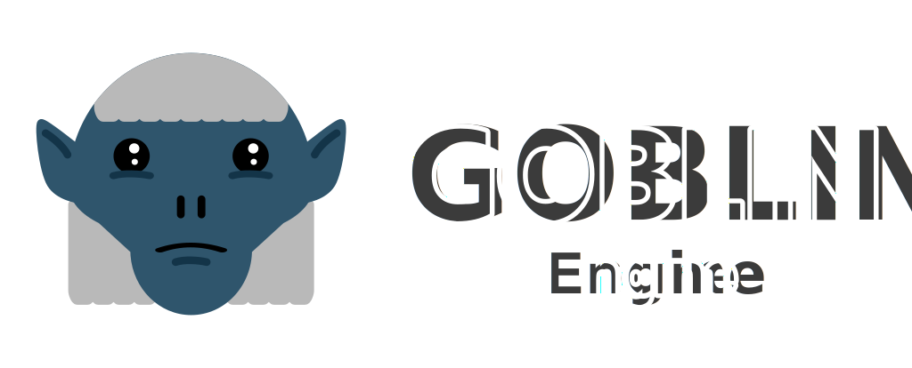

# Goblin Engine

  

## Description

[Goblin Engine](https://goblinengine.github.io) is a custom build of [Godot Engine](https://godotengine.org) created for educational and personal use. It provides additional functionality not officially supported.

The aim of this project is multifold:
- Make the engine more flexible by providing more functionality out of the box
- Implement useful features from scratch or from PRs, Godot forks, modules or adapt GDNative addons into modules so they can be shipped with the engine
- Make minor changes to core without breaking compatibility
- Maintain full compatibility with latest Godot 3.x branch
- All new functionality must be lean and compact adding very little overhead
- Optimize, tweak, polish the current set of feature

I think I should also clarify the design philsophy behind this project:

The official project is in a permanent state of change. Every release brings new features and breaks old ones. Goblin aims to slow down and focus on what we have, add quality of life changes or add new but light weight features that expand what is possible to create with this tool. The aim is not to create a competitive game engine but rather a flexible multimedia tool that can be used for education, art, music, games, software or any other projects.

Please have a look at list of [Goblin Changes](https://github.com/goblinengine/goblin/blob/main/CHANGELOG.md) to find out more details.

## Builds

Note that at this time Goblin has no official releases since is very new. 

You would need to compile it from scratch or you can download test builds [from here](https://github.com/goblinengine/goblin/actions).

All test builds use [thin LTO](http://blog.llvm.org/2016/06/thinlto-scalable-and-incremental-lto.html) which is 90% of the speed/size of a full official release, have no debug symbols and provide a release template and an editor if supported for each platform. The builds are created automatically by GitHub in a sterile environment but have no certificates making OSes complain but are safe to run. They might not run on M1 macs since they are not codesigned. A workaround is to run it in Rosetta compatibility mode.

Goblin will not provide any Mono builds since the goal is to keep the engine lean and compact. The focus is primarily on GDScript and GDNative ecosystem. 

## Community and contributing

There is no community as of yet but PRs welcome. There are a number of features that I am still looking to add: 
- performance fixes
- custom GDScript functionality
- various module or PR backports or forwardports

## Documentation and demos

Since Goblin Engine is compatible with latest 3.x Godot branch, you can find most the documentation you need over at [Godot Docs](https://docs.godotengine.org/en/stable/).

Goblin adds some new functionality which is only documented in the built in Class References accessible from the Goblin Editor from Help menu.

The official demos are maintained in their own [GitHub repository](https://github.com/godotengine/godot-demo-projects). There are also a number of other
[learning resources](https://docs.godotengine.org/en/stable/community/tutorials.html) such as text and video tutorials, demos, etc from the official project.

